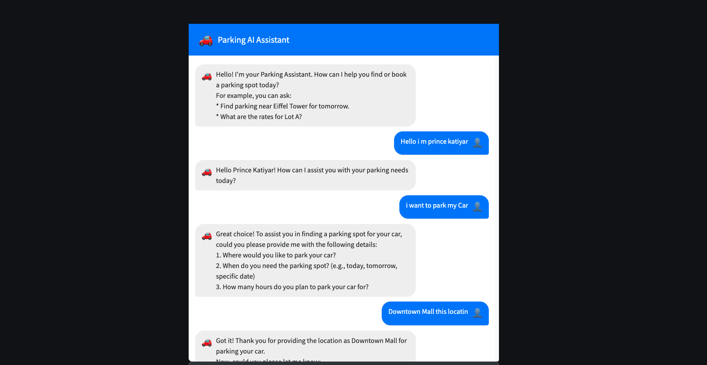

# 🚗 AI-Powered Smart Parking System

Welcome to the AI-Powered Smart Parking System! This project revolutionizes how you find and book parking spots. Our intelligent assistant helps you check slot availability in real-time and provides a seamless booking experience. Say goodbye to parking hassles!

## 🌟 Core Features

-   **Smart Slot Checking:** Instantly find available parking spots near your destination.
-   **Seamless Booking:** Reserve your preferred parking slot directly through the assistant.
-   **Conversational AI:** Interact naturally with our AI assistant for all your parking needs.
-   **Personalized Experience:** The assistant can remember your preferences (like vehicle type) for future interactions within the same session.
-   **Real-time Updates (Conceptual):** Designed with the potential to integrate with real-time parking data.

## 🛠️ Tech Stack

-   **Backend API:** FastAPI
-   **AI Orchestration:** LangChain, LangChain-OpenAI
-   **Language Model:** OpenAI (GPT series)
-   **Vector Database:** Milvus (for semantic search, conversation memory)
-   **Database (Relational):** SQLite (managed by SQLAlchemy)
-   **User Interface:** Streamlit
-   **Server:** Uvicorn (for FastAPI)
-   **Environment Management:** Python-dotenv
-   **Containerization (for Milvus):** Docker

## 🚀 Getting Started

### Prerequisites

1.  **Python 3.8+**: Ensure Python is installed on your system.
2.  **Docker**: Required for easily running a Milvus instance. [Install Docker](https://docs.docker.com/get-docker/)
3.  **OpenAI API Key**: You'll need an API key from [OpenAI](https://platform.openai.com/).

### Setup Instructions

1.  **Clone the Repository (if applicable):**
    ```bash
    # git clone <your-repository-url>
    # cd ai-powered-smart-parking-system
    ```
    (If starting from scratch, create the project directory structure.)

2.  **Set Up Milvus with Docker:**
    This is the recommended way to run Milvus for development.
    ```bash
    docker run -d --name milvus_standalone \
      -p 19530:19530 \
      -p 9091:9091 \
      milvusdb/milvus:v2.3.10-standalone
    ```
    *(You can replace `v2.3.10-standalone` with a more recent stable version from [Milvus Docker Hub](https://hub.docker.com/r/milvusdb/milvus/tags). Ensure Milvus is running and accessible on `localhost:19530`.)*

3.  **Create Virtual Environment & Install Dependencies:**
    Navigate to your project root directory.
    ```bash
    python -m venv venv
    source venv/bin/activate  # For macOS/Linux
    # venv\Scripts\activate    # For Windows
    pip install -r requirements.txt
    ```

4.  **Configure Environment Variables:**
    Create a `.env` file in the project root directory (`ai-powered-smart-parking-system/.env`) with the following content:
    ```env
    OPENAI_API_KEY="your_openai_api_key_here"
    MILVUS_HOST="localhost"
    MILVUS_PORT="19530"
    MILVUS_COLLECTION_NAME="parking_conversations"
    # API_BASE_URL="http://localhost:8000" # Used by Streamlit to find FastAPI
    ```
    Replace `"your_openai_api_key_here"` with your actual OpenAI API key. The `MILVUS_COLLECTION_NAME` should match what's used in `milvus_utils/milvus_connector.py`.

5.  **Initialize Database & Milvus Collection:**
    *   **SQLite & Initial Data:** The FastAPI app handles SQLite table creation on startup. If needed, you can also run the initialization script manually:
        ```bash
        # Ensure you are in the project root
        python -m app.initial_data
        ```
    *   **Milvus Collection:** The specified Milvus collection is typically created automatically on application startup (e.g., when `milvus_connector.py` is used). You can also verify or create it:
        ```bash
        # Ensure you are in the project root
        python -m milvus_utils.milvus_connector
        ```

## ⚙️ Running the System

To bring the AI-Powered Smart Parking System to life, you need to run two main components: the FastAPI backend and the Streamlit UI.

1.  **Start the FastAPI Backend:**
    *   Open a terminal.
    *   Activate your virtual environment: `source venv/bin/activate`
    *   Navigate to the project root directory.
    *   Run Uvicorn:
        ```bash
        uvicorn app.main:app --reload --host 0.0.0.0 --port 8000
        ```
    *   Keep this terminal running. The backend is now live at `http://localhost:8000`. API docs are usually at `http://localhost:8000/docs`.

2.  **Start the Streamlit User Interface:**
    *   Open a **new** terminal.
    *   Activate your virtual environment: `source venv/bin/activate`
    *   Navigate to the project root directory.
    *   Run Streamlit:
        ```bash
        streamlit run ui/app.py
        ```
    *   Keep this terminal running. The UI will typically open in your browser at `http://localhost:8501`.

## 💬 Using the System

Once both backend and UI are running:

1.  Open the Streamlit UI in your web browser (e.g., `http://localhost:8501`).
2.  Begin your conversation with the AI Parking Assistant!

    **Example Interactions:**
    *   🗣️ **User:** "I need parking for my SUV near City Center for 3 hours tomorrow."
    *   🤖 **Assistant:** (Provides available slots)
    *   🗣️ **User:** "Book slot ID 2 for me."
    *   🤖 **Assistant:** (Confirms booking or asks for more details)

    **Tips:**
    *   **Missing Information:** If you simply say "I need parking," the agent will guide you by asking for necessary details like location, vehicle type, duration, etc.
    *   **Conversational Memory:** The assistant can remember details from your current session (e.g., if you mentioned your vehicle type earlier).

## 📦 Key Dependencies

The project relies on several key Python libraries (full list in `requirements.txt`):

-   `fastapi` & `uvicorn`: For building and serving the backend API.
-   `sqlalchemy`: ORM for SQLite database interactions.
-   `pydantic`: Data validation and settings.
-   `python-dotenv`: Managing environment variables from `.env` files.
-   `openai`: Official Python client for OpenAI API.
-   `langchain`, `langchain-openai`: For the AI agent, memory, and LLM integration.
-   `pymilvus`: Python client for interacting with Milvus.
-   `streamlit`: For creating the interactive web UI.
-   `tiktoken`: For token counting, often used with OpenAI models.

## 🤔 Troubleshooting

-   **OpenAI API Errors:** Double-check your `OPENAI_API_KEY` in `.env`. Ensure your OpenAI account has active billing and sufficient credits.
-   **Milvus Connection Issues:** Verify the Milvus Docker container is running and accessible on `localhost:19530`. Check Docker logs for Milvus (`docker logs milvus_standalone`).
-   **`ModuleNotFoundError`**: Make sure your virtual environment is activated and you've run `pip install -r requirements.txt`.
-   **Streamlit UI Can't Connect to Backend:**
    *   Confirm the FastAPI backend (Step 1 in "Running the System") is running without errors.
    *   Ensure the `API_BASE_URL` (if explicitly used by Streamlit to call FastAPI) in `.env` or your Streamlit code points to `http://localhost:8000`.
    *   Check for firewall issues that might block local connections.


    ## 🏗️ System Architecture

    Below is a diagram illustrating the architecture of the AI-Powered Smart Parking System:

    


    ## Check  Screenshot in docs Folder 
    docs/Screenshot 2025-05-15 at 9.30.51 AM.png
    
    
## 🤝 Contributing

Contributions are highly appreciated!
1.  Fork the Project.
2.  Create your Feature Branch (`git checkout -b feature/YourAmazingFeature`).
3.  Commit your Changes (`git commit -m 'Add some YourAmazingFeature'`).
4.  Push to the Branch (`git push origin feature/YourAmazingFeature`).
5.  Open a Pull Request.

## 📜 License

Distributed under the MIT License. See `LICENSE` file for more information. (Create a `LICENSE` file if you haven't already).

